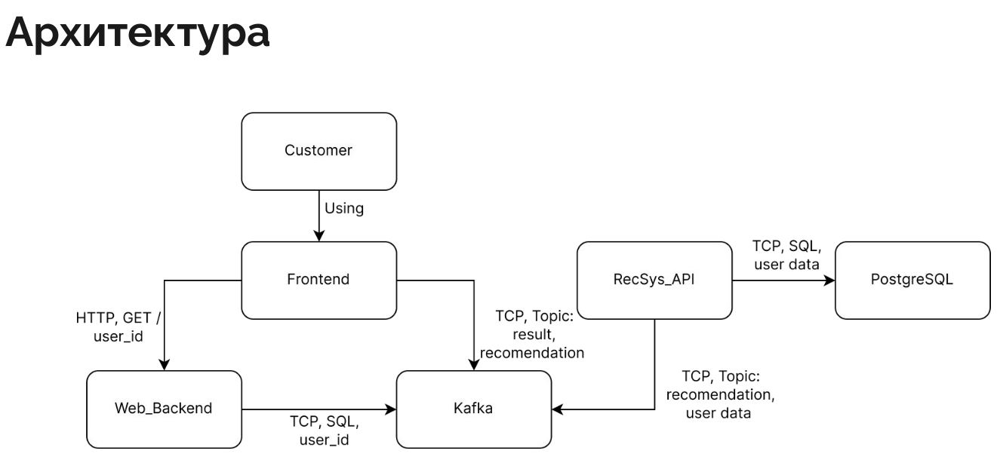
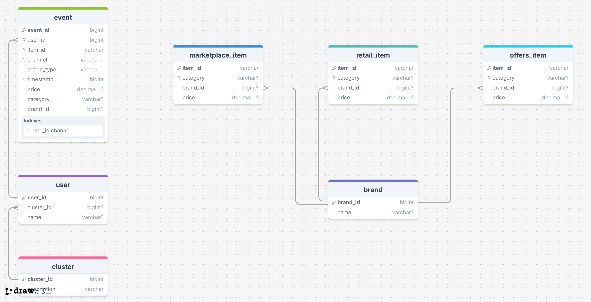

# AI Сhallenge: Banking
## Кейс: Рекомендательная система банковских продуктов
## Команда AI #31

### Состав команды:
Павлов Иван - Teamlead, Backend 
Копылов Михаил - Data science, Backend 
Соколов Арсений - Data science, Data engineering 
Марченко Алексей - Frontend, Data science 

### Проблема кейса:
Текущие механизмы используют данные ограниченно, игнорируют сложные паттерны поведения, что вытекает в низкую конверсию и нерелевантные рекомендации. Нет подробной истории о взаимодействии пользователей с банковскими продуктами.

### Видение решения:
Строим рекомендации при помощи глубокого анализа LLM продуктов ПСБ банка на основе пользовательского портрета, основанного на поведении пользователя, его истории трат и принадлежности к социально-демографическому кластеру.

### Результаты работы:
1. Используя рекомендательный алгоритм, основанный на применении LLM с предварительной обработкой данных, получили релевантные рекомендации продуктов ПСБ для каждого пользователя.
2. Придумали архитектуру, повышающую расширяемость и отказоустойчивость системы.
3. Реализовали решение в коде, развернули в docker контейнеры.
4. Данные всех пользователей загрузили в БД.
5. Написали тестовый UI с использованием фреймворка Streamlit для демонстрации решения.

### Архитектура сервиса

### Диаграмма БД

